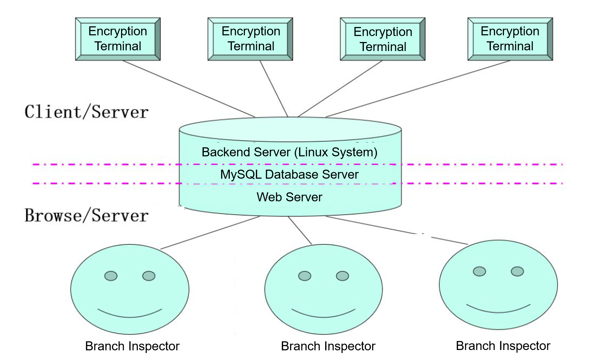
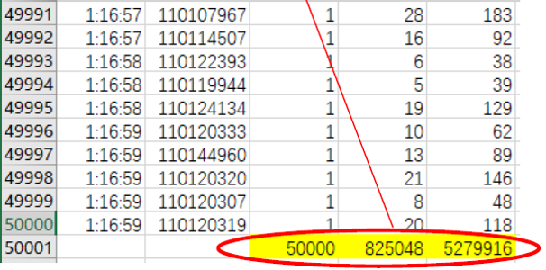
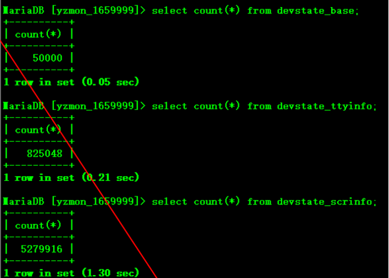

# End to End Encryption Emulator

- [Background](#background)
- [Client](#client)
- [Server](#server)
- [Database Design](docs/database-design.md)
- [Transmission Protocol Design](docs/transmission-protocol-design.md)

## Background

A terminal encryption machine has been applied by each branch of a bank for the transmission encryption of production services. Now it is required to monitor each encryption terminal.

The specific design is:

1. Run a Client program on each encryption terminal. Each encryption terminal has a `devid`, each terminal includes several ttys and each tty has several screens.
2. Transmit the configuration, current status, etc. to the main server.
3. The Server daemon program running on the main server, which is used to receive the information sent from each encryption terminal, and store the data into MySQL database for Web users to inspect.



## Client

- [Client Usage](#client-usage)
- [Client Design](#client-design)
- [Client Test](#client-test)
- [Client Difficulties](#client-difficulties)

### Client Usage

1. Make the Client

```bash
# Go into the client directory and then make.
make
```

2. Run the Client by CLI with arguments:

- The first argument is the initial `devid` number.
- The second argument is the quantity of the clients.

```bash
# Emulate 50000 Clients with devid from 110101001 to 110151000 to send data to the main server.
./ts 110101001 50000
```

### Client Design

1. The Client is written in C/C++, with **forking method** (one process one socket). Each forked child emulates a `devid` to connect to the main server, and do all the work of data transmission.
2. The main process of the Client records the initial time, then fork childs to emulate data transmission. After the transmission ends, the main process recycles all child processes and records the ending time. The duration of the whole Client work is written into the log.
3. Each child process is designed based on the OSI module. For the convenience and compactness of the child process, all OSI layers are combined together.
4. Children process read configurations from [ts.conf](client/ts.conf) (in Simplified Chinese), read data payload to be transmitted from [config.dat](client/config.dat), [process.dat](client/process.dat) and [usbfiles.dat](client/usbfiles.dat). The detailed transmission protocol design can be seen [here](docs/transmission-protocol-design.md).
5. To have a safe and efficient TCP sending, each TCP connection is arranged a writting circular queue, with a safe length (102400 bytes).
6. Each child process write into the `ts_count.xls` for a line, including:

- transaction time
- `devid`
- number of devid (1)
- number of ttys
- number of screens

| TRANSACTION TIME | `devid` | NUM OF `devid` (1) | NUM OF TTYS | NUM OF SCREENS |
| :--------------: | :-----: | :----------------: | :---------: | :------------: |
|     hh:mm:ss     | `devid` |         1          | NUM OF TTYS | NUM OF SCREENS |

### Client Test

1. A qualified Server daemon will run on the main server, with TCP port number designated and exposed. Server is a black box to the clients.
2. For debugging convenience, the logs of Server will be output to the Client side as `logfile` and `pidfile` with all debugging options open.
3. The database which Server accesses is `yzmon` (see [Database Design](docs/database-design.md)), there are only 3 tables that is related to the Server:

- `devstate_base`: base information of clients.
- `devstate_ttyinfo`: information of the ttys of the clients.
- `devstate_scrinfo`: information of the screens of each tty.

4. Clients should write logs of the transmission, which includes the detailed information of transmission / reception packs, and compare the information sent with the information stored in the database by the server to verify the correctness of the program.
5. The configuration of the Clients should be read from [ts.conf](client/ts.conf) (in Simplified Chinese of GBK encoding), which should not be fixedly written into the program.
6. The quantity of emulated clients is at least 50000, each child process with a different `devid`.
7. The duration time of the whole Client work should be written into the log. The total transmission time should be less than 900s for 50000 `devid`.
8. After transmission, check the consistency of the Client's `ts_count.xls` and the `SELECT count(*) from devstate_xxx` in `yzmon` database in Server, that whether the sums of dev, ttyinfo and scrinfo are identical.





### Client Difficulties

1. When `devid` is set as a big number (such as 50000), the system resources(memory, total active processes, TCP/IP protocol stack) are not enough. To make all clients run, we set the `kNumProcess` in `client_lib.hpp` to limit the number of the coexisting processes. All children processes should obey FIFO law. The best number is around 100.
2. How to keep the correctness for different processes to write the same file `ts_count.xls`?

- Add a mutex lock for the file accessing.
- Let the main process write the file.

## Server

- [Server Usage](#server-usage)
- [Server Design](#server-design)
- [Server Test](#server-test)
- [Server Difficulties](#server-difficulties)

### Server Usage

1. Make the Server

```bash
# Go into the server directory and then make.
make
```

2. Run the Server by CLI:

```bash
# Emulate the server as a daemon running on the main server.
./yzmond
```

### Server Design

1. The Server, written in C/C++, is designed based on the OSI module. For the convenience and compactness of the child process, all OSI layers are combined into the same process, but each instance has its own class and class instance.
2. Server read configurations from [yzmond.conf](server/yzmond.conf).
3. The connections are arranged by `epoll`.
4. The Server writes MySQL with a single process. MySQL writting has its own class and class instance.
5. To have a safe and efficient TCP receiving, each TCP connection is arranged a reading circular queue, with a safe length (102400 bytes).

### Server Test

1. Run up the server daemon on a designated IP and port configurated in the configuration file [yzmond.conf](server/yzmond.conf) (in Simplified Chinese of GBK encoding).
2. The database which Server accesses is `yzmon` (see [Database Design](docs/database-design.md)), there are only 3 tables that is related to the Server:

- `devstate_base`: base information of clients.
- `devstate_ttyinfo`: information of the ttys of the clients.
- `devstate_scrinfo`: information of the screens of each tty.

3. Server should write logs of the transmission, which includes the detailed information of transmission / reception packs, and compare the information sent with the information stored in the database by the server, and the log from corresponding clients to verify the correctness of the program.
4. Server should be able to serve at least 50000 incoming clients.

### Server Difficulties

1. To write MySQL efficiently, MySQL writting has its own class, class instance and process.
2. `select` method can only maintain connections no more than 1024. To arrange at least 50000 possible connections, we should use `epoll`.
3. When having multiple TCP sockets read/write together, the system resources(memory, total active processes, TCP/IP protocol stack) may be not enough. To avoid the possible problems, we set the coexisting active sockets to 100, and the sockets obey the FIFO law.
